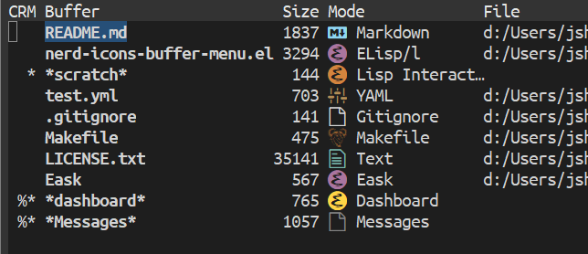

[](https://www.gnu.org/licenses/gpl-3.0)
[](https://jcs-emacs.github.io/jcs-elpa/#/nerd-icons-buffer-menu)

# nerd-icons-buffer-menu
> Display nerd icons in `buffer-menu`

[](https://github.com/jcs-elpa/nerd-icons-buffer-menu/actions/workflows/test.yml)

<p align="center">

</p>

## 💾 Installation

### 🔍 Method 1. with `straight.el` and `use-package`:

```elisp
(use-package nerd-icons-buffer-menu
  :straight (nerd-icons-buffer-menu :type git :host github :repo "jcs-elpa/nerd-icons-buffer-menu"))
```

### 🔍 Method 2. Manual

```sh
git clone https://github.com/jcs-elpa/nerd-icons-buffer-menu /path/to/lib
```

then in Emacs:

```elisp
(add-to-list 'load-path "/path/to/lib")
(require 'nerd-icons-buffer-menu)
```

or

```elisp
(use-package nerd-icons-buffer-menu
  :load-path "/path/to/lib")
```

## 🔨 Usage

```elisp
(use-package nerd-icons-buffer-menu
  :ensure t
  :hook (Buffer-menu-mode . nerd-icons-buffer-menu-mode))
```

## Contribute

[](http://makeapullrequest.com)
[](https://github.com/bbatsov/emacs-lisp-style-guide)
[](https://www.paypal.me/jcs090218)
[](https://www.patreon.com/jcs090218)

If you would like to contribute to this project, you may either
clone and make pull requests to this repository. Or you can
clone the project and establish your own branch of this tool.
Any methods are welcome!
